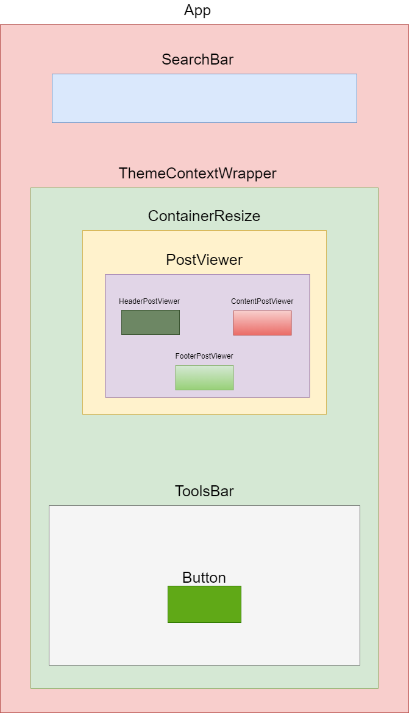

# Twimage

Ce petit projet consiste à réaliser un site web reprenant certaines fonctionnalités du célèbre site [poet.so](https://poet.so/).
Le but de ce projet était de nous former à React.

Voici les fonctionalités implémentées dans cette version du site : 
- Import d'un tweet Twitter et affichage dans le site
- Possibilité de redimensionner le Tweet
- Possibilité de modifier les couleurs du tweet
- Possibilité d'exporter le tweet au format image PNG
- Affichage ou non des likes, nombre de RT, ...

ATTENTION : Ce projet fonctionne avec le back présent [ici](https://github.com/ld-web/twitter-api-express-client). Vous pouvez-également lancer ce projet en utilisant un stub. Pour faire cela, saisir le pramètre suivant dans le fichier .env du projet : 
``USE-MOCK=true``

**Voici quelques images du site :**

## Installation

Saisir la commande ``npm install`` pour installer les dépendances du projet.

## Démarrage

Saisir la commande ``npm start`` pour lancer le projet.

## Modification du back

Pour que Twimage fonctionne avec le back, il faut apporter des modifications à celui-ci avant de le démarrer : 
- Ajouter les lignes suivantes dans le fichier .env du back :
  ``TWITTER_BEARER_TOKEN=TokenDeLAPITwitter
PORT=3248``
- Remplacer l'url Twiter du fichier index.js par celle-ci : 
  ``https://api.twitter.com/2/tweets/${tweetId}?tweet.fields=created_at,public_metrics&user.fields=description,profile_image_url&expansions=author_id,referenced_tweets.id,attachments.media_keys&media.fields=url``

## Fabriqué avec

* [React JS](https://fr.reactjs.org/) - Langage utilisé
* [Axios](https://axios-http.com/) - Client HTTP permettant de faciliter l'envoi de requêtes aux API
* [L'API Twitter](https://developer.twitter.com/) - API permettant de récupérer le contenu des Tweets
* [Sass](https://sass-lang.com/) - Langage de script permettant de compiler du CSS
* [html-to-image](https://www.npmjs.com/package/html-to-image) - Bibliothèque permettant la transformation d'un composant HTML en image
* [download JS](https://www.npmjs.com/package/downloadjs) - Bibliothèque permettant le téléchargement de l'image convertie
* [Font Awesome](https://fontawesome.com/) - Bibliothèque fournissant un ensembles d'icones SVG

## Architecture générale

### Diagramme de classes de l'architecture permettant de contacter le back / le stub :

ApiCallerService est un classe abstraite qui contient une méthode "getPost". Cette méthode utilise les méthodes "computeUrl" et "mapResponse" qui sont abstraites et donc définies dans les classes "StubTwitterApiService" et "TwitterApiCallerService". Cette architecture permettra de rajouter de nouveaux services pour d'autres réseaux sociaux tels que LinkedIn ou encore Instagram.

### Architecture des composants React : 

## Hooks utilisés

* **createContext** - Utilisé pour que les différents composants React aient connaissance de l'état courant du mode sombre (clair/sombre)
* **useState** - Utilisé plusieurs fois dans le projet. Nottament pour la gestion du changement de Tweet. Le composant SearchBar reçoit en paramètre la fonction setTweetId. Lorsque setTweetId va être appelé par le composant, son état va changer dans App.js. Lorsque son état change, la fonction setTweet du second state va être appelée et cela va entraîner l'appel à l'API de Twitter
* **useEffect** - Utilisé pour contacter l'API Twitter lorsque le TweetId change dans App.js
* **useRef** - Utilisé dans le composant SearchBar. Lorsque le bouton "Rechercher" va être appuyé, la valeur du useRef va être récupérée. Cette valeur est référencée dans l'input de la barre de recherche

## Auteurs

- Théo RAMOUSSE
- Antoine PICARD
