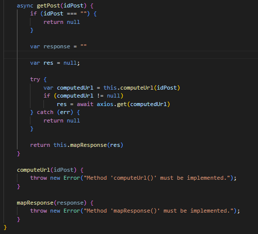

# Twimage

Ce petit projet consiste à réaliser un site web reprenant certaines fonctionnalités du célèbre site [poet.so](https://poet.so/).
Le but de ce projet était de nous former à React. Nous avons choisi de le réaliser car nous trouvions techniquement intéressant de comprendre comment un tweet pouvait être transformé en une image. De plus, par le passé, Théo avait déjà travaillé avec l'API Twitter (la première version de l'API utilisait un système d'autentification différent). Il suhaitait donc voir comment mettre en place un échange avec la nouvelle version de l'API.

Voici les fonctionalités implémentées dans la version actuelle du site : 
- Import d'un tweet Twitter et affichage dans le site
- Possibilité de redimensionner le Tweet
- Possibilité de modifier les couleurs du tweet
- Possibilité d'exporter le tweet au format image PNG
- Affichage ou non des likes, nombre de RT, ...

ATTENTION : Ce projet fonctionne avec le back présent [ici](https://github.com/ld-web/twitter-api-express-client). Vous pouvez-également lancer ce projet en utilisant un stub. Pour faire cela, saisir le pramètre suivant dans le fichier .env du projet : 
``
USE_MOCK=true
``
Si vous souhaitez utiliser le back, il faudra alors renseigner les paramètres suivants dans le .env : 
``
REACT_APP_USE_MOCK=false
REACT_APP_BACK_BASE_URL=UrlDuBack
REACT_APP_BACK_PORT=PortDuBack
``

**Voici quelques images du site :**

## Installation

Saisir la commande ``npm install`` pour installer les dépendances du projet.

## Démarrage

Saisir la commande ``npm start`` pour lancer le projet.

## Modification du back

Pour que Twimage fonctionne avec le back, il faut apporter des modifications à celui-ci avant de le démarrer : 
- Ajouter les lignes suivantes dans le fichier .env du back :
  ``TWITTER_BEARER_TOKEN=TokenDeLAPITwitter
PORT=3248``
- Remplacer l'url Twiter du fichier index.js par celle-ci : 
  ``https://api.twitter.com/2/tweets/${tweetId}?tweet.fields=created_at,public_metrics&user.fields=description,profile_image_url&expansions=author_id,referenced_tweets.id,attachments.media_keys&media.fields=url``

## Fabriqué avec

* [React JS](https://fr.reactjs.org/) - Langage utilisé
* [Axios](https://axios-http.com/) - Client HTTP permettant de faciliter l'envoi de requêtes aux API
* [L'API Twitter](https://developer.twitter.com/) - API permettant de récupérer le contenu des Tweets
* [Sass](https://sass-lang.com/) - Langage de script permettant de compiler du CSS
* [html-to-image](https://www.npmjs.com/package/html-to-image) - Bibliothèque permettant la transformation d'un composant HTML en image
* [download JS](https://www.npmjs.com/package/downloadjs) - Bibliothèque permettant le téléchargement de l'image convertie
* [Font Awesome](https://fontawesome.com/) - Bibliothèque fournissant un ensembles d'icones SVG

## Difficultés rencontrées et explications techniques

### Connexion à l'API Twitter

Dès le début du projet, nous avons souhaité mettre en place une connexion à l'API Twitter afin de pouvoir tester notre code avec de vraies données. Nous avons donc créé un compte Twitter et généré un "Bearer Token". Par la suite, nous avons pu tester le bon fonctionnement de l'API grâce à des requêtes PostMan qui sont passées avec succès.

Voici l'URL pour requêter l'API Twiter : 

https://api.twitter.com/2/tweets/1586356158662672386?tweet.fields=created_at,public_metrics&user.fields=description,profile_image_url&expansions=author_id,referenced_tweets.id,attachments.media_keys&media.fields=url

Voici comment lire cette URL: Nous souhaitons utiliser la version 2 de l'API Twitter. Notre requête concerne le tweet avec l'id 1586356158662672386. Nous souhaitons que la donnée retournée contiennent les informations contenues dans le paramètre "tweet.fields", les informations sur l'utilisateur à l'origine du tweet avec les champs contenus dans le paramètre "user.fields". Nous souhaitons également les informations complémentaires contenues dans le paramètre "expansion".

Notre principale difficulté a été l'envoie de cette requête avec React. Nous avons utilisé Axios pour contacter cette URL en fournissant le Bearer Token mais la requête ne passait pas. Nous avons donc, dans un premier temps, mis en place un Stub avec des tweets au format JSON.

Par la suite, le professeur nous a expliqué que l'erreur venait en réalité du fait que l'API Twitter n'accepte pas les requêtes provenant d'un navigateur Web. Il faut donc forcément utiliser un back pour réaliser cette action. Le professeur nous a donc fourni un back développé avec Node JS + Express pour envoyer nos requêtes.

Voici comment nous avons implémenté le service permettant de contacter les différentes API (cette méthode permet de rajouter simplement une connexion à une nouvelle API) : 

Cette méthode est commune à tous les services permettant de contacter les API. Elle utilise des méthodes abstraites qui seront implémentées dans les classes filles.

MapResponse permet la suppression des liens raccourcis présents dans les posts Twitter (lorsqu'un utilisateur joint un média à son tweet, le lien raccourci est présent au format texte. Nous ne voulons pas qu'il apparaisse sur le tweet car nous récupérons déjà le média dans un autre champ de la réponse à la requête).
Dans un second temps, la méthode appelle récursivement "getPost" afin de récupérer les tweets cités au sein du tweet.

Pour finir, nous instancions ce service ou le stub dans App.js. Deux states sont utilisés. L'un permet de stocker l'id du tweet extrait de l'url soumise par l'utilisateur. Lorsque ce state change, le useEffect permettant d'appeler "getPost" est appelé et le second state permettant de stocker le tweet est modifié. Par la suite, ce state est envoyé aux différents composants de l'application grâce aux paramètres.

### Mise en place d'un contexte global pour la gestion du mode sombre des Tweets

Nous souhaitions mettre en place un thème sombre pour que les tweets apparaissent avec des couleurs claires ou sombres. Pour faire cela, nous avions besoin que l'état du thème soit connus dans de nombreux coposants à la fois. Nous nous sommes donc dirigés vers l'utilisation d'un contexte global. Voici son implémentation : 

Dans la première version que nous avons développé, nous changions le style des composants graphiques directement dans le "contextWrapper" avec du JS natif. Cette méthode, en plus d'être peu "React Spirit", ne permettait pas de gérer la récursivité (un tweet peut contenir un autre tweet dans le cas d'un retweet) :

Dans la seconde version, nous avons modifié le code pour que le contexte soit connu par tous ses enfants. Pour cela, les enfants appeleront "useContext" pour récupérer les attributs de celui-ci.

Nous avons donc modifié notre code pour que ce soient les composants React qui modifient leurs propres styles en fonction de la valeur du thème :

## Architecture générale

### Diagramme de classes de l'architecture permettant de contacter le back / le stub :

ApiCallerService est un classe abstraite qui contient une méthode "getPost". Cette méthode utilise les méthodes "computeUrl" et "mapResponse" qui sont abstraites et donc définies dans les classes "StubTwitterApiService" et "TwitterApiCallerService". Cette architecture permettra de rajouter de nouveaux services pour d'autres réseaux sociaux tels que LinkedIn ou encore Instagram.

### Architecture des composants React : 

## Hooks utilisés

* **useContext** - Utilisé pour que les différents composants React aient connaissance de l'état courant du mode sombre (clair/sombre)
* **useState** - Utilisé plusieurs fois dans le projet. Nottament pour la gestion du changement de Tweet. Le composant SearchBar reçoit en paramètre la fonction setTweetId. Lorsque setTweetId va être appelé par le composant, son état va changer dans App.js. Lorsque son état change, la fonction setTweet du second state va être appelée et cela va entraîner l'appel à l'API de Twitter
* **useEffect** - Utilisé pour contacter l'API Twitter lorsque le TweetId change dans App.js
* **useRef** - Utilisé dans le composant SearchBar. Lorsque le bouton "Rechercher" va être appuyé, la valeur du useRef va être récupérée. Cette valeur est référencée dans l'input de la barre de recherche. Nous avons également utilisé "useRef" pour le redimensionnement du conteneur du tweet.  

## Auteurs

- Théo RAMOUSSE
- Antoine PICARD
